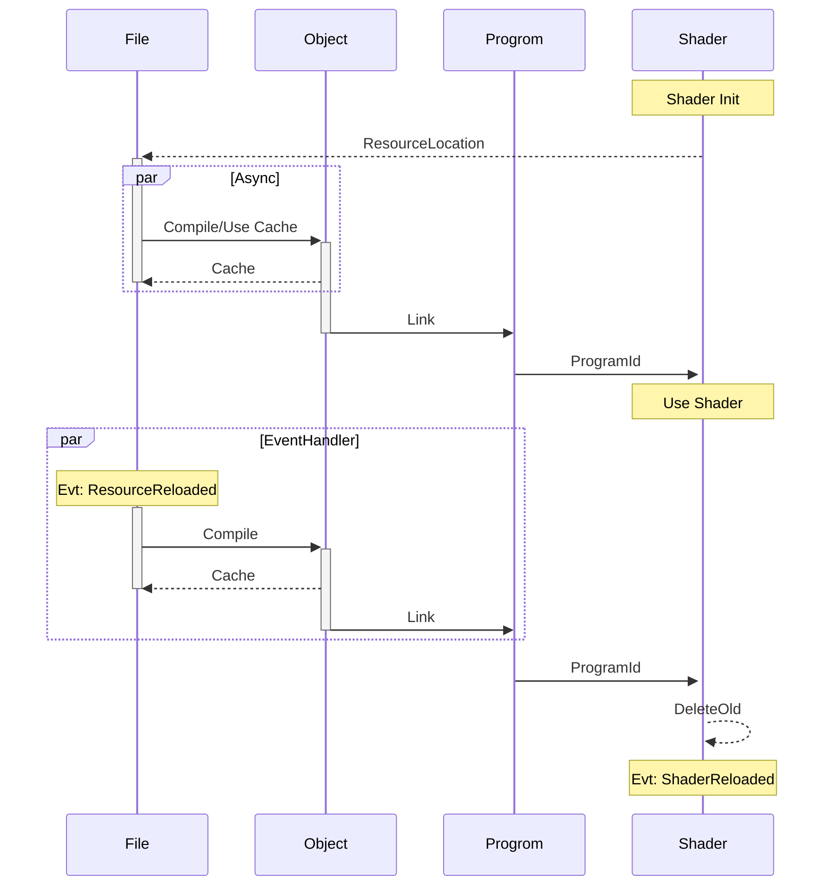
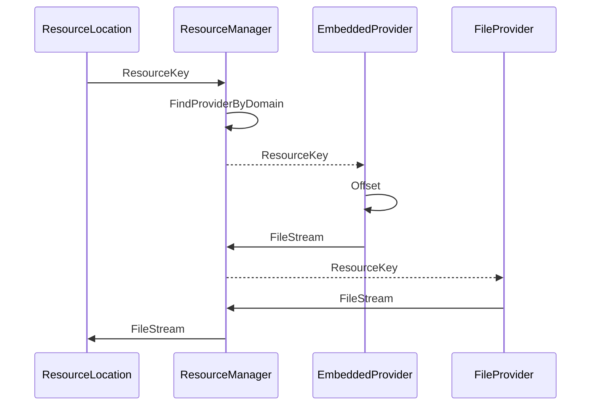

# LearnOpenGL

My learn OpenGL

## Sequence

### Shader

```mermaid
sequenceDiagram
    participant F as File
    participant O as Object
    participant P as Progrom
    participant S as Shader

    %% Init------------------------------------
    Note over S: Shader Init
    S -->>+F: ResourceLocation

    par Async
        F ->>+ O: Compile/Use Cache
        O -->> F: Cache
        deactivate F
    end

    O ->> P: Link
    deactivate O

    P ->>+ S: ProgramId

    Note over S: Use Shader

    %% Reloaded--------------------------------
    par EventHandler
        Note over F: Evt: ResourceReloaded
        activate F

        F ->>+ O: Compile
        O -->> F: Cache
        deactivate F

        O ->> P: Link
        deactivate O
    end

    P ->> S: ProgramId
    S -->> S: DeleteOld
    Note over S: Evt: ShaderReloaded
```

### Resource

```mermaid
sequenceDiagram
    participant R as ResourceLocation
    participant M as ResourceManager
    participant E as EmbeddedProvider
    participant F as FileProvider

    R ->> M: ResourceKey
    M ->> M: FindProviderByDomain

    M -->> E: ResourceKey
    E ->> E: Offset
    E ->> M: FileStream

    M -->> F: ResourceKey
    F ->> M: FileStream

    M ->> R: FileStream
```

## Reference

<https://learnopengl-cn.github.io/intro/>
