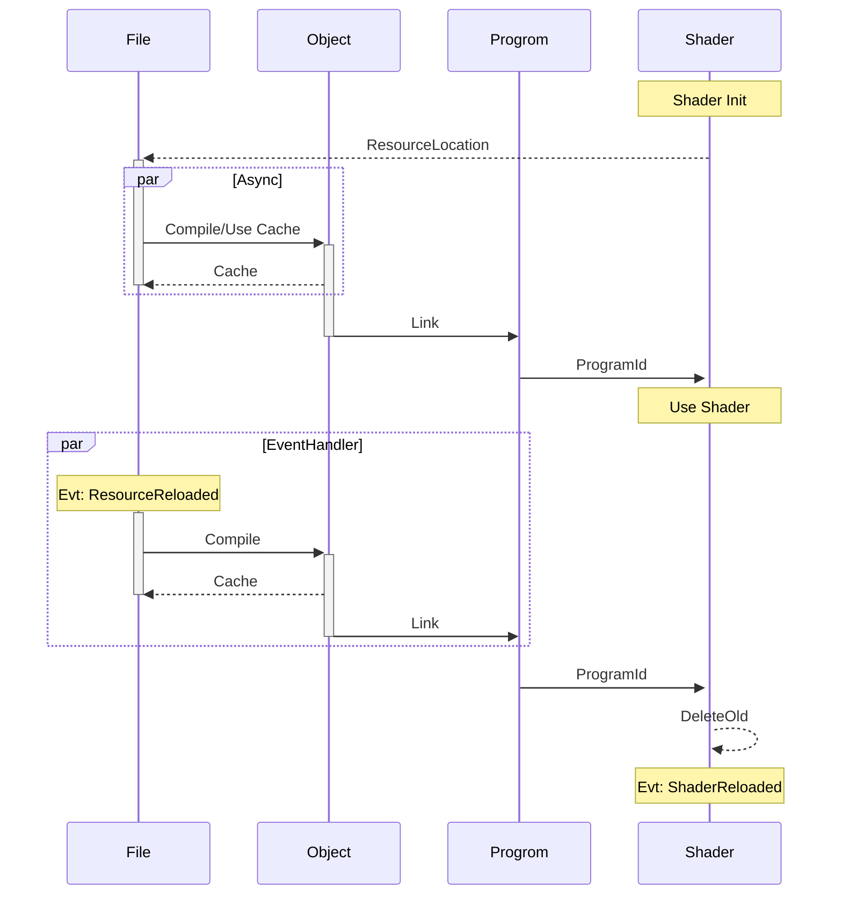

# LearnOpenGL

My learn OpenGL

## Encoding

### Glossary

| Word      | Meaning                                      | Example               |
| --------- | -------------------------------------------- | --------------------- |
| Codepoint | Numerical value maps to a specific character | \u0000                |
| Codepage  | Collection of codepoints                     | GBK; GB2312; Unicode; |
| Encoding  | Codepoint format in bytes                    | UTF-8; UTF-16; ANSI;  |
---

Following table shows the encoding of the strings depends on their physical location:

| Physical Location | Encoding |
| ----------------- | -------- |
| Disk              | UTF-8    |
| Memory(Windows)   | UTF-16   |
| Memory(Linux)     | UTF-32   |

Note: Encoding here is **NOT** regulated by any standard! This regulation only suits in **MY** program!

Following table shows the encoding of the strings depends on their storage class:

| Class                 | Encoding |
| --------------------- | -------- |
| std::string           | UTF-8    |
| std::wstring(Windows) | UTF-16   |
| std::wstring(Linux)   | UTF-32   |
| std::u8string         | UTF-8    |
| std::u16string        | UTF-16   |
| std::u32string        | UTF-32   |

Note: Encoding here is **NOT** regulated by any standard! This regulation only suits in **MY** program!

Note: These string classes won't deal with encodings, which means `split()`,`length()`, `size()`, are base on **bytes** not codepoints.

---

Before using some locale dependent C APIs, we need to set correct locale to ensure correct codepage and encoding are used.

```c++
setlocale(LC_ALL, ".UTF-8");
```

Then the locale-dependent functions, such as `mbstowcs`; `wcstombs`, will return properly translated strings.

Note: Remember to set the encoding for the compiler, for example, use `/utf8` for MSVC.

### std::locale::global

The following code is **Needless** to call, as its default value is `C`, which means it will use the locale set by `setlocale` for C environment.

```c++
std::locale::global(std::locale(".UTF-8"));
```

### Windows

On Windows platform, its API has two encoding versions, one uses the ANSI encoding, and the other uses the `Unicode` codepage and `UTF-16` encoding.

#### ANSI

ANSI is an encoding method that regulates the conversion of codepoints to bytes and vice versa. To identify a specific character using its codepoints, it is necessary to know the codepage being used.

Language specific codepages:
| Codepage | Language            |
| -------- | ------------------- |
| GB2312   | Simplified Chinese  |
| GBK      | Simplified Chinese  |
| GB18030  | Simplified Chinese  |
| Big5     | Traditional Chinese |
| S-JIS    | Japanese            |

ANSI codepages can be different on different computers, or can be changed for a single computer, leading to data corruption. For the most consistent results, applications should use Unicode based API.

#### Unicode

While ANSI uses same encoding method across different codepages, Unicode has only one unique codepage but has different encodings.

Encodings:
| Encoding      | Length   | Range                 | Codepoint Size(Byte) |
| ------------- | -------- | --------------------- | -------------------- |
| UTF-8         | Variable | Full Unicode Codepage | 1 ~ 6                |
| UCS-2         | Fixed    | \u0000 ~ \uFFFF       | 2                    |
| UTF-16        | Variable | Full Unicode Codepage | 2 / 4                |
| UTF-32(UCS-4) | Fixed    | Full Unicode Codepage | 4                    |

## Sequence

### Shader



### Resource


## Reference

<https://learnopengl-cn.github.io/intro/>
